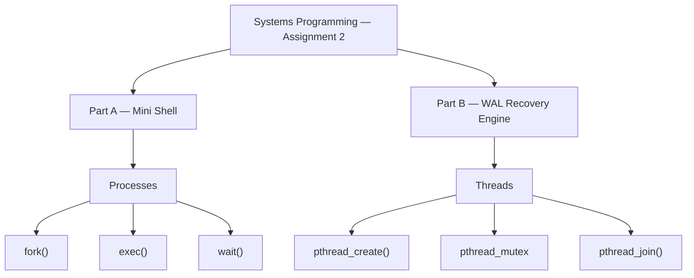
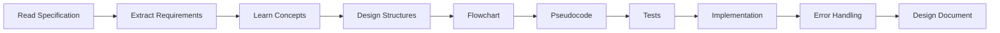
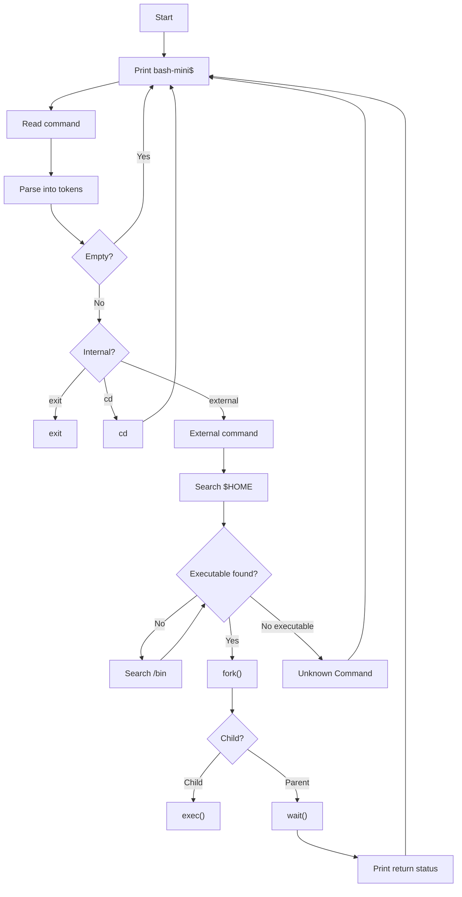
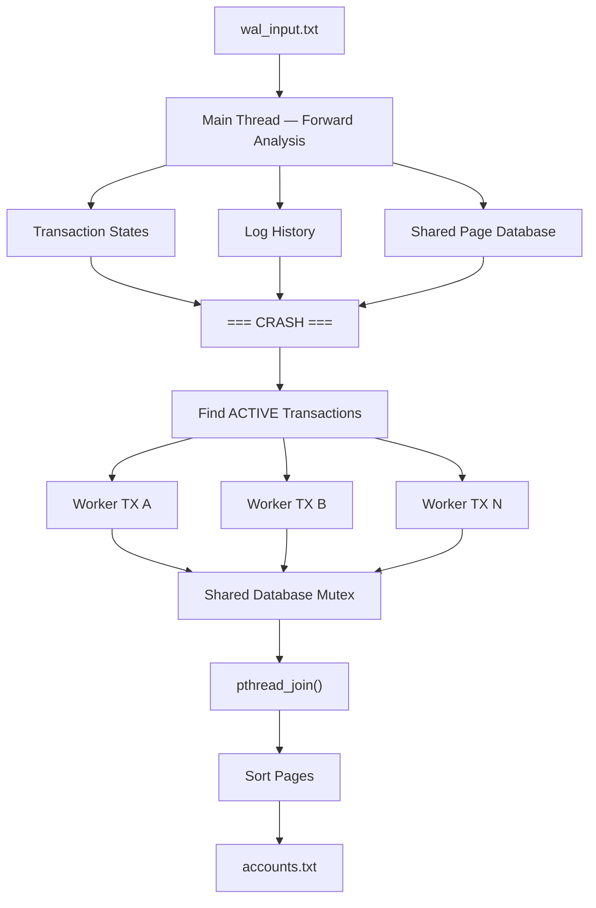
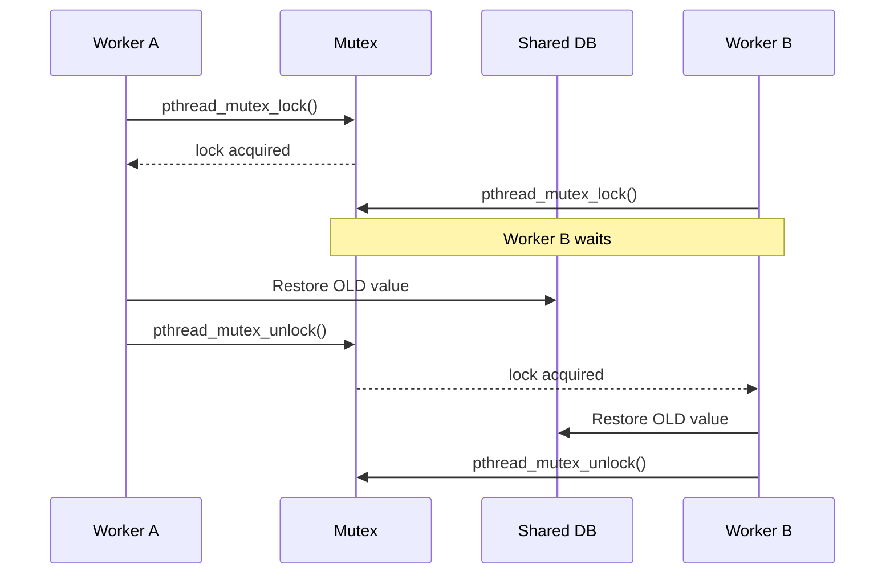

# Systems Programming — Assignment 2 Plan

This document tracks the design, implementation, testing, and documentation of both versions of Assignment 2.

The project contains two independent implementations:

1. **Mini Bash Shell** — process management using `fork()`, `exec()`, and `wait()`.
2. **Multi-Threaded WAL Recovery Engine** — transaction recovery using POSIX threads, mutexes, and parallel rollback.

---

# 1. Project Overview



The two programs are intentionally kept independent.

The Shell focuses on **process creation and program execution**.

The WAL engine focuses on **threads, shared memory, synchronization, and crash recovery**.

---

# 2. Repository Structure

Target structure:

```text
SysProg-ex2/
│
├── docs/
│   ├── ex2.pdf
│   └── ex2-challenging.pdf
│
├── shell/
│   ├── bash_mini.c
│   └── tests/
│
├── wal/
│   ├── wal_recovery.c
│   ├── tests/
│   └── fixtures/
│
├── PLAN.md
├── README.md
├── Makefile
└── .gitignore
```

---

# 3. Development Strategy

For both implementations we follow the same development process:



The goal is to understand and design each subsystem **before implementing it**.

---

# PART A — MINI BASH SHELL

# 4. Shell Goal

Create a small interactive command interpreter.

Basic lifecycle:

```text
Prompt
   ↓
Read
   ↓
Parse
   ↓
Classify
   ↓
Execute
   ↓
Wait if necessary
   ↓
Repeat
```

---

# 5. Shell Architecture



---

# 6. Shell Concepts to Understand

Before implementing the Shell:

* [ ] Process
* [ ] PID
* [ ] Parent process
* [ ] Child process
* [ ] Process address space
* [ ] `fork()`
* [ ] Fork return values
* [ ] `exec()` family
* [ ] Why `exec()` does not create a process
* [ ] `wait()` / child termination
* [ ] Exit status
* [ ] Environment variables
* [ ] `$HOME`
* [ ] Current Working Directory
* [ ] `chdir()`
* [ ] Executable permissions
* [ ] `argv`
* [ ] Tokenization
* [ ] EOF / Ctrl-D

---

# 7. Shell Milestones

## Phase S0 — Design

* [ ] Extract all requirements from `docs/ex2.pdf`
* [ ] Define required behavior
* [ ] Define error cases
* [ ] Design helper functions
* [ ] Write full pseudocode
* [ ] Define tests

---

## Phase S1 — Basic Shell Loop

Implement only:

```text
start
 ↓
prompt
 ↓
read
 ↓
print/read again
```

Tasks:

* [ ] Create `shell/bash_mini.c`
* [ ] Print `bash-mini$`
* [ ] Read a command
* [ ] Handle empty lines
* [ ] Handle EOF
* [ ] Repeat

---

## Phase S2 — Command Parsing

Transform:

```text
ls -l /home
```

into:

```text
argv[0] -> "ls"
argv[1] -> "-l"
argv[2] -> "/home"
argv[3] -> NULL
```

Tasks:

* [ ] Split on spaces
* [ ] Split on tabs
* [ ] Avoid unnecessary string copying
* [ ] Generate `argv`
* [ ] Test multiple spaces
* [ ] Test tabs
* [ ] Test empty input

---

## Phase S3 — Internal Commands

### `exit`

* [ ] Detect `exit`
* [ ] Terminate shell loop cleanly

### `cd`

* [ ] Detect `cd`
* [ ] Extract target directory
* [ ] Call `chdir()`
* [ ] Handle errors
* [ ] Verify that following commands use the new directory

---

## Phase S4 — Executable Search

Search order:

```text
$HOME/<command>
       ↓
   if absent
       ↓
/bin/<command>
       ↓
   if absent
       ↓
Unknown Command
```

Tasks:

* [ ] Read `$HOME`
* [ ] Construct `$HOME/<command>`
* [ ] Check whether candidate exists
* [ ] Verify executable permission
* [ ] Search `/bin`
* [ ] Print required Unknown Command error

---

## Phase S5 — Process Execution

Implement:

```text
Shell
  │
  └── fork()
        │
        ├── Parent
        │     └── wait()
        │
        └── Child
              └── exec()
```

Tasks:

* [ ] Call `fork()`
* [ ] Handle `fork() < 0`
* [ ] Identify parent
* [ ] Identify child
* [ ] Execute command in child
* [ ] Handle failed `exec()` with `perror()`
* [ ] Parent waits
* [ ] Decode termination status
* [ ] Print return code

---

# 8. Shell Function Plan

Possible decomposition:

```text
main
 │
 └── run_shell
      │
      ├── read_command
      ├── parse_command
      ├── execute_builtin
      │    ├── exit
      │    └── cd
      │
      ├── find_executable
      │    ├── search HOME
      │    └── search /bin
      │
      └── execute_external
           ├── fork
           ├── exec
           └── wait
```

Exact function names may change during design.

The goal is to keep `main()` small and make each helper responsible for one logical operation.

---

# 9. Shell Test Plan

## Parsing

* [ ] Empty line
* [ ] Spaces only
* [ ] Tabs only
* [ ] One command
* [ ] Command + one argument
* [ ] Command + several arguments
* [ ] Multiple spaces between arguments
* [ ] Mixed spaces and tabs

## Built-ins

* [ ] `exit`
* [ ] `cd` valid directory
* [ ] `cd` invalid directory

## Search

* [ ] Executable exists in `$HOME`
* [ ] File exists in `$HOME` but is not executable
* [ ] Command found in `/bin`
* [ ] Command not found anywhere

## Processes

* [ ] Child returns `0`
* [ ] Child returns non-zero
* [ ] `exec()` failure
* [ ] Shell continues after child finishes

## Input

* [ ] EOF
* [ ] Repeated commands
* [ ] Long input

---

# PART B — MULTI-THREADED WAL RECOVERY

# 10. WAL Goal

Read a Write-Ahead Log up to:

```text
=== CRASH ===
```

Reconstruct the current database state and perform rollback for transactions that remained ACTIVE at the crash.

---

# 11. WAL High-Level Architecture



---

# 12. WAL Concepts to Understand

* [ ] ACID
* [ ] Atomicity
* [ ] Consistency
* [ ] Isolation
* [ ] Durability
* [ ] Write-Ahead Logging
* [ ] Transaction
* [ ] BEGIN
* [ ] UPDATE
* [ ] COMMIT
* [ ] ABORT
* [ ] Crash recovery
* [ ] Undo
* [ ] Forward pass
* [ ] Reverse log traversal
* [ ] Thread
* [ ] Shared address space
* [ ] Race condition
* [ ] Critical section
* [ ] Mutex
* [ ] Deadlock
* [ ] `pthread_create()`
* [ ] `pthread_mutex_lock()`
* [ ] `pthread_mutex_unlock()`
* [ ] `pthread_join()`

---

# 13. WAL Data Structures

Initial design:

```text
TxState
 ├── INACTIVE
 ├── ACTIVE
 ├── COMMITTED
 └── ABORTED
```

```text
Page
 ├── key
 └── value
```

```text
LogEntry
 ├── tx_id
 ├── key
 ├── old_value
 └── new_value
```

```text
SharedDatabase
 ├── pages[]
 ├── page_count
 └── mutex
```

```text
ThreadArgs
 ├── target_tx_id
 ├── log_history
 ├── log_size
 └── database
```

---

# 14. WAL Milestones

## Phase W0 — Design

* [ ] Extract requirements from `docs/ex2-challenging.pdf`
* [ ] Define parser grammar
* [ ] Define transaction table
* [ ] Define Page structure
* [ ] Define LogEntry structure
* [ ] Define ThreadArgs
* [ ] Define error handling strategy

---

## Phase W1 — WAL Reader

* [ ] Open `wal_input.txt`
* [ ] Read line-by-line
* [ ] Ignore blank lines
* [ ] Stop immediately at `=== CRASH ===`
* [ ] Reject or report malformed records appropriately

No threads yet.

---

## Phase W2 — Parser

Recognize:

```text
TX<ID> BEGIN
TX<ID> UPDATE <KEY> OLD:<VAL1> NEW:<VAL2>
TX<ID> COMMIT
TX<ID> ABORT
=== CRASH ===
```

Tasks:

* [ ] Parse transaction ID
* [ ] Parse command type
* [ ] Parse key
* [ ] Parse OLD value
* [ ] Parse NEW value

---

## Phase W3 — Forward Analysis

For every UPDATE:

```text
Save LogEntry
      +
Apply NEW value
```

Tasks:

* [ ] Maintain transaction states
* [ ] Maintain page table
* [ ] Maintain log history
* [ ] Detect ACTIVE transactions after crash

At this point the entire engine should work **single-threaded up to recovery preparation**.

---

## Phase W4 — Single Worker Undo

Before adding concurrency:

* [ ] Implement worker rollback logic
* [ ] Traverse history backwards
* [ ] Match only worker transaction ID
* [ ] Restore OLD values
* [ ] Verify single ACTIVE transaction recovery

---

## Phase W5 — Parallel Undo

For each ACTIVE transaction:

```text
ACTIVE TX
   ↓
pthread_create()
   ↓
Worker Thread
```

Tasks:

* [ ] Count ACTIVE transactions
* [ ] Allocate thread array
* [ ] Allocate ThreadArgs array
* [ ] Create one worker per ACTIVE transaction
* [ ] Check every `pthread_create()` result

---

# 15. Critical Section

Workers share the same database.

```text
Worker A ─────┐
              │
              ▼
        SharedDatabase
              ▲
              │
Worker B ─────┘
```

Without synchronization:

```text
Concurrent update
      ↓
Race Condition
```

Protected execution:

```text
LOCK
 │
 ▼
Update Page
 │
 ▼
UNLOCK
```



Tasks:

* [ ] Identify exact critical section
* [ ] Lock before modifying shared Pages
* [ ] Unlock immediately after modification
* [ ] Avoid holding mutex while scanning log history
* [ ] Check mutex operation errors

---

# 16. WAL Completion

After creating workers:

```text
Main
 │
 ├── join Worker 1
 ├── join Worker 2
 ├── ...
 └── join Worker N
       │
       ▼
All recovery complete
```

Then:

* [ ] Destroy mutex
* [ ] Sort pages alphabetically
* [ ] Write `accounts.txt`
* [ ] Free allocated resources
* [ ] Close files

---

# 17. WAL Test Plan

## Basic Recovery

* [ ] One committed transaction
* [ ] One active transaction
* [ ] One aborted transaction
* [ ] Committed + active
* [ ] Multiple committed transactions
* [ ] Multiple active transactions

## Update Behavior

* [ ] One page
* [ ] Multiple pages
* [ ] Same transaction updates same page several times
* [ ] Different transactions update different pages
* [ ] Different ACTIVE transactions update the same page

## Input

* [ ] Empty lines
* [ ] Crash immediately
* [ ] No crash marker
* [ ] Malformed UPDATE
* [ ] Invalid transaction ID
* [ ] Missing input file

## Threading

* [ ] Zero active workers
* [ ] One active worker
* [ ] Several workers
* [ ] Shared-page contention
* [ ] Thread creation failure handling
* [ ] Mutex failure handling

---

# 18. Questions / Specification Ambiguities

These cases must be investigated before finalizing recovery semantics.

## Q1 — Multiple ACTIVE transactions modifying the same page

Example:

```text
TX1 BEGIN
TX1 UPDATE X OLD:0 NEW:1

TX2 BEGIN
TX2 UPDATE X OLD:1 NEW:2

=== CRASH ===
```

Both transactions require Undo.

A mutex prevents simultaneous writes, but it does not automatically guarantee the required global Undo order.

* [ ] Determine lecturer's intended behavior
* [ ] Add explicit test case
* [ ] Document chosen solution

---

## Q2 — ABORT semantics

Example:

```text
TX1 BEGIN
TX1 UPDATE X OLD:10 NEW:20
TX1 ABORT

=== CRASH ===
```

The forward pass applies `NEW`, but parallel recovery is specified for ACTIVE transactions.

* [ ] Determine whether ABORT performs immediate rollback
* [ ] Determine whether aborted transactions should be undone during analysis
* [ ] Add test
* [ ] Document final interpretation

---

# 19. Build System

Required root commands:

```bash
make
make shell
make wal

make test
make test-shell
make test-wal

make clean
```

Compiler baseline:

```text
gcc
-Wall
-Wextra
-std=gnu11
-O2
```

Strict testing additionally uses:

```text
-Werror
```

WAL additionally requires:

```text
-pthread
```

---

# 20. Documentation Plan

Each program will eventually receive its own design documentation.

```text
docs/
    shell-design.md
    wal-design.md
```

## Shell Design Document

* [ ] Purpose
* [ ] Shell execution flow
* [ ] Parsing
* [ ] Internal commands
* [ ] Executable lookup
* [ ] `fork()`
* [ ] `exec()`
* [ ] `wait()`
* [ ] System-call return values
* [ ] Error handling
* [ ] System-call efficiency
* [ ] Flowchart

## WAL Design Document

* [ ] Purpose
* [ ] WAL / ACID overview
* [ ] Data structures
* [ ] Forward analysis
* [ ] Transaction state tracking
* [ ] Worker architecture
* [ ] Shared-memory model
* [ ] Critical sections
* [ ] Mutex strategy
* [ ] Race-condition prevention
* [ ] Deadlock reasoning
* [ ] Error handling
* [ ] Edge cases
* [ ] Flowchart

---

# 21. Progress Board

## Repository Foundation

* [ ] Repository connected
* [ ] Base project committed
* [ ] `.gitignore`
* [ ] Root Makefile
* [ ] `PLAN.md`
* [ ] README skeleton
* [ ] Assignment PDFs moved to `docs/`

## Mini Shell

* [ ] Requirements
* [ ] Concepts
* [ ] Architecture
* [ ] Pseudocode
* [ ] Shell loop
* [ ] Parser
* [ ] Built-ins
* [ ] Executable lookup
* [ ] `fork()`
* [ ] `exec()`
* [ ] `wait()`
* [ ] Error handling
* [ ] Tests
* [ ] Design document

## WAL Engine

* [ ] Requirements
* [ ] ACID/WAL concepts
* [ ] Architecture
* [ ] Data structures
* [ ] Parser
* [ ] Forward analysis
* [ ] ACTIVE detection
* [ ] Single worker Undo
* [ ] Parallel workers
* [ ] Mutex
* [ ] Join
* [ ] Sorting/output
* [ ] Error handling
* [ ] Tests
* [ ] Design document

---

# 22. Current Goal

**Milestone 0 — Establish the repository and project skeleton.**

After Milestone 0:

```text
GitHub repository connected
            ↓
Directory structure ready
            ↓
Makefile ready
            ↓
PLAN.md ready
            ↓
First baseline commit
            ↓
Begin Mini Shell requirements + pseudocode
```

Do not begin full implementation until the Shell requirement map and pseudocode are completed.
