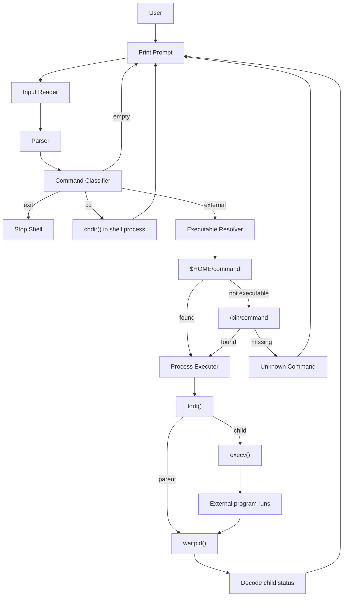

# Bash Mini — Architecture & Code Walkthrough

> Systems Programming — Assignment 2  
> Mini Bash Shell  
> Source: [`shell/bash_mini.c`](../shell/bash_mini.c)  
> Assignment specification: [`docs/ex2.pdf`](./ex2.pdf)

---

## 1. What this program is

`bash_mini` is a small command interpreter whose job is to sit between the user and the operating system.

Its basic lifecycle is:

```text
prompt -> read -> parse -> classify -> execute -> repeat
```

The program has two main responsibilities:

1. **Command dispatcher** — decide whether a command belongs to the shell itself or must be executed as an external program.
2. **Process manager** — create a child process for external programs, replace the child program using `execv()`, and wait for that child to finish.

The shell does **not** implement commands such as `ls`, `pwd`, or `cat`. It only finds their executable files and runs them.

Example:

```text
bash-mini$ ls -l
```

The shell does not understand what `-l` means. It produces an argument vector:

```text
argv[0] -> "ls"
argv[1] -> "-l"
argv[2] -> NULL
```

and passes it to `/bin/ls`. The `ls` program interprets `-l`.

---

## 2. High-level architecture



The architecture is intentionally separated into components so each responsibility can be understood and tested independently.

---

## 3. Why this architecture was chosen

The assignment focuses on the Linux/POSIX process model, especially:

- `fork()`
- `exec*()`
- `wait()/waitpid()`
- `chdir()`
- direct system-call style I/O
- efficient buffer management

The implementation therefore avoids `system()` and does not delegate shell behavior to another shell.

The main design principle is:

> **Separate command interpretation from process execution.**

This produces the following components:

| Component | Responsibility |
|---|---|
| Output | reliably print the prompt |
| Input Reader | obtain one logical command line |
| Parser | convert the line into `argv[]` |
| Classifier | decide empty / `exit` / `cd` / external |
| Built-in Handler | execute shell-owned operations |
| Executable Resolver | search `$HOME`, then `/bin` |
| Process Executor | `fork -> execv / waitpid` |
| Shell Controller | coordinate all components |
| `main()` | start the controller |

### Benefits

- `main()` stays very small.
- each function has one main responsibility.
- low-level system-call behavior is isolated.
- the code is easier to test.
- future features can be added without rewriting the whole shell.

### Cost

The program is longer than a minimal solution because buffering, error handling, and helper functions are explicit.

That extra code is intentional: it demonstrates the operating-system concepts the assignment is meant to teach.

---

# 4. Constants and limits

The program uses named constants rather than scattering literal values through the code.

```c
#define PROMPT "bash-mini$ "
#define BIN_DIRECTORY "/bin"

#define INPUT_CHUNK_SIZE 4096
#define MAX_COMMAND_LEN 4096
#define MAX_ARGS 128
```

## `PROMPT`

Single source of truth for the interactive prompt.

Changing:

```c
#define PROMPT "bash-mini$ "
```

to:

```c
#define PROMPT "dor-shell> "
```

changes the prompt everywhere.

## `BIN_DIRECTORY`

Represents the second search location required by the assignment.

The search policy is:

```text
$HOME/<command>
        |
        v
/bin/<command>
```

This is intentionally **not** a normal `$PATH` search.

## `INPUT_CHUNK_SIZE`

The internal input cache can hold up to 4096 bytes from a single refill.

This does **not** mean `read()` always returns 4096 bytes. It means:

> request **up to** 4096 bytes.

Possible return values:

```text
> 0   number of bytes actually read
  0   EOF
 -1   error
```

### Why 4096?

It is a practical fixed buffer size:

- small memory cost: about 4 KiB,
- large enough to avoid reading one character at a time,
- allows one `read()` to collect several piped commands,
- simple fixed-size memory model.

It is **not** assumed to be a universally optimal Linux I/O size.

## `MAX_COMMAND_LEN`

Maximum command-line storage.

Because C strings require a trailing NUL byte:

```text
4095 command characters
+ 1 '\0'
-----------------------
4096 bytes
```

## `MAX_ARGS`

Capacity of the `argv` pointer array.

```text
127 token pointers
+ 1 final NULL pointer
----------------------
128 entries
```

`execv()` uses the final `NULL` to know where the argument vector ends.

---

# 5. Error policy

Two different error mechanisms are used.

## `ERROR_MSG(...)`

Used for errors generated by shell logic.

Examples:

- too many arguments,
- command too long,
- unknown command,
- invalid `cd` usage.

These messages go to `stderr`.

## `SYSTEM_ERROR(message)`

Wraps `perror()` and is used immediately after an errno-based failure.

Examples:

```text
chdir()
fork()
execv()
waitpid()
read()
write()
```

Conceptually:

```text
system/API failure
      |
      v
    errno
      |
      v
 perror()
      |
      v
human-readable diagnostic
```

This keeps normal command output separate from shell diagnostics.

---

# 6. Custom types

## `InputStatus`

```c
typedef enum
{
    INPUT_OK,
    INPUT_EOF,
    INPUT_TOO_LONG,
    INPUT_ERROR
} InputStatus;
```

The input component has four meaningful outcomes.

| State | Meaning | Controller action |
|---|---|---|
| `INPUT_OK` | one command is available | parse |
| `INPUT_EOF` | input source ended | stop shell |
| `INPUT_TOO_LONG` | command exceeded buffer | print error and continue |
| `INPUT_ERROR` | unrecoverable read error | terminate shell |

Using an enum is clearer than returning unexplained integers.

---

## `CommandType`

```c
typedef enum
{
    CMD_EMPTY,
    CMD_EXIT,
    CMD_CD,
    CMD_EXTERNAL
} CommandType;
```

The classifier maps text into the behavior the shell must perform.

```text
""          -> CMD_EMPTY
exit        -> CMD_EXIT
cd /tmp     -> CMD_CD
ls -l       -> CMD_EXTERNAL
```

---

## `ResolveStatus`

```c
typedef enum
{
    RESOLVE_ERROR = -1,
    RESOLVE_NOT_FOUND = 0,
    RESOLVE_FOUND = 1
} ResolveStatus;
```

There are three different resolver outcomes:

- the executable was found,
- the lookup completed normally but nothing was found,
- the resolver itself encountered a representational error.

A missing command is not the same thing as an internal program failure.

---

## `InputReader`

```c
typedef struct
{
    char data[INPUT_CHUNK_SIZE];
    size_t position;
    size_t length;
} InputReader;
```

This structure stores bytes already obtained from standard input.

```text
InputReader
+-------------------------------------------+
| data[]                                    |
|  p w d \n l s \n e x i t \n ...          |
|          ^                                |
|          position                         |
|                                           |
| length = number of valid bytes in data    |
+-------------------------------------------+
```

### Fields

`data`

- raw bytes returned by `read()`.

`position`

- index of the next unread cached byte.

`length`

- number of valid bytes currently stored in `data`.

### Why keep this state?

Suppose stdin is a pipe containing:

```text
pwd\nls\nexit\n
```

One `read()` may receive all three commands.

The shell must return only `pwd` to the current iteration while remembering:

```text
ls\nexit\n
```

for future iterations.

---

# 7. Function map

| Function | Component | Main responsibility |
|---|---|---|
| `write_all()` | Output | robust full write |
| `print_prompt()` | Output | print shell prompt |
| `read_command_line()` | Input | return exactly one logical command |
| `parse_command()` | Parser | build `argv[]` in place |
| `classify_command()` | Classifier | determine command category |
| `handle_cd()` | Built-in | change shell working directory |
| `build_path()` | Resolver | safely build `directory/command` |
| `resolve_executable()` | Resolver | search `$HOME` then `/bin` |
| `wait_for_child()` | Process | wait for exact child |
| `print_child_status()` | Process | decode wait status |
| `execute_external()` | Process | `fork -> execv / waitpid` |
| `run_shell()` | Controller | shell lifecycle |
| `main()` | Entry point | delegate to controller |

---

# 8. `write_all()`

```c
static int write_all(int fd, const char *buffer, size_t count)
```

## Purpose

Turn the weaker guarantee of `write()` into:

> write every requested byte, or return failure.

A single `write()` is allowed to perform a partial write.

Example:

```text
requested: 10 bytes
written:    4 bytes
remaining:  6 bytes
```

The helper therefore tracks:

```c
size_t written_total = 0;
```

and repeats until:

```text
written_total == count
```

## Pointer arithmetic

The important call is conceptually:

```c
write(fd,
      buffer + written_total,
      count - written_total);
```

Example:

```text
buffer = "abcdefghij"

first write:
buffer + 0 -> "abcdefghij"
request 10
returns 4

second write:
buffer + 4 -> "efghij"
request 6
```

## `EINTR`

If:

```c
errno == EINTR
```

the call was interrupted by a signal.

The helper retries rather than treating this as a permanent failure.

## Zero-byte progress

A zero-length result for a positive request would not advance `written_total`.

Without a guard, the loop could spin forever.

The implementation therefore treats no-progress as failure.

## Why this approach?

### Pros

- handles partial writes,
- signal-interruption safe,
- reusable,
- directly continues the robust I/O principles from Assignment 1.

### Cons

For a tiny prompt, it is more code than a single `write()`.

The robust helper is kept because the assignment is specifically about system programming correctness.

---

# 9. `print_prompt()`

```c
static int print_prompt(void)
```

## Purpose

Hide the low-level output details from `run_shell()`.

The controller can say:

```c
print_prompt();
```

instead of knowing:

- stdout file descriptor,
- prompt pointer,
- prompt length,
- robust write policy.

## Current implementation

It calls:

```c
write_all(STDOUT_FILENO, PROMPT, strlen(PROMPT))
```

### Possible micro-improvement

Because `PROMPT` is a compile-time string literal, this would also work:

```c
sizeof(PROMPT) - 1
```

The `-1` excludes the trailing `'\0'`.

This is only a minor optimization/readability choice; modern compilers normally optimize `strlen()` of a string literal.

---

# 10. `read_command_line()`

```c
static InputStatus read_command_line(
    InputReader *reader,
    char *line,
    size_t line_capacity)
```

This is the most complex low-level function in the shell.

## Responsibility

Return **one logical command line** even if one `read()` receives:

- part of a line,
- exactly one line,
- multiple lines.

## Local state

```c
size_t line_length = 0;
bool overflow = false;
```

`line_length`

- number of characters copied into the output command buffer.

`overflow`

- remembers that the command exceeded the available destination space.

## Parameter validation

Invalid pointers or zero capacity produce:

```text
errno = EINVAL
INPUT_ERROR
```

## Refill condition

```c
reader->position == reader->length
```

means all cached bytes have been consumed.

The function then performs another:

```c
read(STDIN_FILENO, ...)
```

## `read()` retry policy

`read()` is retried when:

```c
errno == EINTR
```

This is useful for ordinary transient signal interruptions.

A future Ctrl+C extension may intentionally change this policy for `SIGINT`; see the signal section below.

## EOF

`read()` returning `0` means EOF.

There are two useful cases.

### No accumulated command

Return:

```text
INPUT_EOF
```

### Final line without newline

A file may end with:

```text
pwd
```

instead of:

```text
pwd\n
```

If characters were already accumulated, the shell accepts them as the final command and adds:

```c
'\0'
```

## CRLF compatibility

Windows text commonly uses:

```text
\r\n
```

Linux commonly uses:

```text
\n
```

The function removes a trailing `'\r'` so redirected Windows-created command files still behave correctly.

## Command-too-long behavior

The function does **not** return immediately when the destination buffer fills.

Instead it keeps consuming input until the next newline.

Why?

Suppose input is:

```text
<5000-character invalid command>\nls\n
```

If the function returned immediately at character 4096, the remaining part of the oversized command could be interpreted as a new command.

Instead:

```text
detect overflow
      |
      v
discard remaining characters
      |
      v
reach newline
      |
      v
return INPUT_TOO_LONG
```

The next call then begins cleanly at `ls`.

## Why this design?

### Pros

- few system calls,
- supports terminal, file and pipe input,
- preserves unread data,
- clean behavior after overflow,
- no heap allocation.

### Cons

- more complex than `fgets()`,
- fixed maximum command length,
- signal handling at the prompt needs more thought.

---

# 11. `parse_command()`

```c
static int parse_command(
    char *line,
    char **argv,
    size_t argv_capacity)
```

## Purpose

Convert:

```text
ls -l /home
```

into an `execv()`-compatible argument vector.

## In-place parsing

The parser does not allocate new strings.

Before:

```text
l s   - l   / h o m e \0
```

After delimiter replacement:

```text
l s \0 - l \0 / h o m e \0
^       ^      ^
|       |      |
argv[0] argv[1] argv[2]
```

Then:

```text
argv[3] = NULL
```

The pointers refer directly to the original command buffer.

## Why this is efficient

A copying parser might allocate/copy:

```text
"ls"
"-l"
"/home"
```

separately.

The current parser only stores pointers.

### Pros

- no per-token allocation,
- no duplicated text,
- directly compatible with `execv()`,
- easy cleanup because there is nothing to free.

### Cons

- the original command buffer is modified,
- tokens are only valid while that buffer remains alive,
- grammar is intentionally simple.

---

# 12. Current command grammar

The current parser recognizes:

```text
TOKEN { SPACE_OR_TAB TOKEN }
```

Separators are:

- `' '`
- `'\t'`

This matches the assignment.

## Supported

```text
ls -l
cat file.txt
cd /tmp
```

## Not supported

```text
echo "hello world"
cat file | grep x
ls > output.txt
cmd1 && cmd2
cmd &
```

These require a more advanced grammar.

The current limitation is intentional rather than a bug.

---

# 13. `classify_command()`

```c
static CommandType classify_command(
    int argc,
    char *const argv[])
```

## Purpose

Map parsed input to shell behavior.

```text
no tokens -> CMD_EMPTY
exit      -> CMD_EXIT
cd        -> CMD_CD
anything else -> CMD_EXTERNAL
```

The parser determines token structure.

The classifier determines semantic category.

That separation keeps each component simple.

## Current edge case

Because classification only checks:

```c
argv[0]
```

this input:

```text
exit anything
```

still becomes `CMD_EXIT`.

The assignment does not define extra `exit` arguments.

A stricter version could validate:

```text
argc == 1
```

before stopping.

---

# 14. `handle_cd()`

```c
static int handle_cd(
    int argc,
    char *const argv[])
```

## Purpose

Execute the `cd` built-in.

The current implementation requires exactly:

```text
cd <directory>
```

## Why `cd` must be built in

Current directory is process state.

Imagine:

```text
shell parent cwd = /home/dor
```

If the shell forked and only the child ran:

```c
chdir("/tmp")
```

the result would be:

```text
parent cwd = /home/dor
child  cwd = /tmp
```

When the child exits, the parent is still in `/home/dor`.

Therefore `chdir()` must run in the shell process itself.

## Failure

`chdir()` returning `-1` sets `errno`.

`SYSTEM_ERROR("cd")` then prints the system diagnostic.

## Pros

- correct process semantics,
- minimal behavior matching the assignment.

## Future extensions

Real Bash additionally supports behavior such as:

```text
cd
cd -
~
```

These are outside the required implementation.

---

# 15. `build_path()`

```c
static int build_path(
    char *destination,
    size_t destination_size,
    const char *directory,
    const char *command)
```

## Purpose

Safely construct:

```text
<directory>/<command>
```

Example:

```text
directory = "/bin"
command   = "ls"

result:
"/bin/ls"
```

## Why `snprintf()`

Unlike `sprintf()`, `snprintf()` receives the destination capacity.

The function rejects output when:

```text
written >= destination_size
```

which means the full path did not fit.

This prevents writing beyond the destination buffer.

---

# 16. `resolve_executable()`

```c
static ResolveStatus resolve_executable(...)
```

## Purpose

Implement the assignment's search policy:

```text
1. $HOME/<command>
2. /bin/<command>
```

## `$HOME`

The controller reads the environment variable using:

```c
getenv("HOME")
```

Example:

```text
HOME=/home/dor
command=my_cp
```

candidate:

```text
/home/dor/my_cp
```

## `access(..., X_OK)`

The resolver checks whether the current process has execute permission for the candidate.

```c
access(path, X_OK)
```

returning `0` means the access check succeeded.

## Fallback

If the HOME candidate is not executable, the resolver tries:

```text
/bin/<command>
```

## Why `execv()` remains final authority

There is time between:

```text
access()
```

and:

```text
execv()
```

The filesystem could theoretically change during that interval.

This general issue is called a TOCTOU race:

```text
Time Of Check
     |
     v
Time Of Use
```

For this assignment, `access()` is useful for implementing the required search policy, but `execv()` is still the final test of whether execution succeeds.

---

# 17. `wait_for_child()`

```c
static int wait_for_child(
    pid_t child_pid,
    int *status)
```

## Purpose

Wait specifically for the child just created by the shell.

```c
waitpid(child_pid, status, 0)
```

is more explicit than waiting for an arbitrary child.

## `EINTR`

If a signal interrupts `waitpid()`, the helper retries.

## Why waiting matters

The shell runs external programs in the foreground:

```text
shell
  |
 fork
 /   \
child parent
 |     |
exec  wait
 |
exit
  \___/
    |
next prompt
```

It also **reaps** the terminated child so the process does not remain as a zombie.

---

# 18. `print_child_status()`

```c
static void print_child_status(
    const char *command,
    int status)
```

`waitpid()` stores an **encoded** termination status.

It is not simply the external program's return code.

## Normal exit

```c
WIFEXITED(status)
```

tests whether the process ended normally.

Then:

```c
WEXITSTATUS(status)
```

extracts the return code.

Example:

```text
child calls exit(5)

WIFEXITED(status)  -> true
WEXITSTATUS(status)-> 5
```

## Signal termination

```c
WIFSIGNALED(status)
```

means the child was terminated by a signal.

```c
WTERMSIG(status)
```

returns that signal number.

This becomes useful if Ctrl+C support is added later.

## `fflush(stdout)`

The status message is flushed before the next prompt.

This helps maintain sensible ordering when stdout is redirected or piped.

---

# 19. `execute_external()`

```c
static int execute_external(
    const char *path,
    char *const argv[])
```

This function contains the central process-management logic.

---

## `fork()`

Before:

```text
one shell process
```

After successful `fork()`:

```text
          fork()
         /      \
        /        \
   parent        child
```

Return values:

```text
< 0  failure
= 0  current code is running in child
> 0  current code is running in parent;
     value is child PID
```

---

## Child branch

```c
if (child_pid == 0)
```

The child calls:

```c
execv(path, argv)
```

### `execv()` does not create a new process

Before:

```text
PID 4201
program = bash_mini
```

After successful exec:

```text
PID 4201
program = /bin/ls
```

Same process identity, different program image.

### Why `execv()`?

The shell has already resolved an exact executable path.

`execvp()` would search `$PATH`, which is not the assignment's required lookup behavior.

`execv()` accepts:

```text
exact path + argv vector
```

which matches the current architecture.

### Successful `execv()` never returns

Therefore:

```c
execv(...);
perror(...);
```

has a useful meaning:

> if execution reaches `perror()`, `execv()` failed.

### `_exit()`

After failed exec, the child uses:

```c
_exit(EXIT_FAILURE)
```

rather than normal `exit()`.

This terminates the child immediately without performing inherited standard-I/O cleanup intended for the parent shell process.

---

## Parent branch

The parent skips the child-only branch and calls:

```c
wait_for_child(child_pid, &status)
```

Then it prints the decoded result.

## Current execution model

External commands are foreground-only.

The shell does not support:

```text
command &
```

or job control.

That is correct for the assignment.

---

# 20. `run_shell()`

```c
static int run_shell(void)
```

The controller owns the shell's long-lived runtime state and coordinates the components.

## Runtime objects

### Input cache

```c
InputReader reader = {0};
```

All fields start at zero.

### Command buffer

```c
char command_line[MAX_COMMAND_LEN];
```

Stores one logical command line.

### Argument vector

```c
char *argv[MAX_ARGS];
```

Stores pointers into `command_line`.

### Resolved path

```c
char resolved_path[PATH_MAX];
```

Stores a candidate such as:

```text
/bin/ls
```

### HOME pointer

```c
const char *home = getenv("HOME");
```

The value is obtained once when the shell controller starts.

### Loop state

```c
bool shell_running = true;
```

---

## Main loop

```c
while (shell_running)
```

Each iteration performs:

```text
prompt
  |
read
  |
parse
  |
classify
  |
execute
  |
repeat
```

### Input outcomes

`INPUT_EOF`

- leave loop.

`INPUT_TOO_LONG`

- report error and begin a fresh iteration.

`INPUT_ERROR`

- terminate with failure.

### Parser failure

Too many tokens cause an error, then the shell continues.

### Command switch

`CMD_EMPTY`

- do nothing.

`CMD_EXIT`

- set `shell_running = false`.

`CMD_CD`

- call the built-in handler.

`CMD_EXTERNAL`

- resolve path and execute.

## Why `(void)` is used

Examples:

```c
(void)handle_cd(...);
(void)execute_external(...);
```

This communicates:

> the return value is intentionally ignored here.

The helper has already performed/reporting its local error handling, and the shell should remain alive.

---

# 21. `main()`

```c
int main(void)
{
    return run_shell();
}
```

This is intentionally small.

The entry point has no command-processing policy.

Its job is simply:

```text
start shell
   |
   v
return shell result
```

This keeps orchestration in `run_shell()` and avoids turning `main()` into a large monolithic function.

---

# 22. Full example: `ls -l`

Input:

```text
bash-mini$ ls -l
```

### 1. Reader

Returns:

```text
"ls -l"
```

### 2. Parser

Produces:

```text
argv[0] -> "ls"
argv[1] -> "-l"
argv[2] -> NULL
argc = 2
```

### 3. Classifier

`ls` is neither `exit` nor `cd`.

Result:

```text
CMD_EXTERNAL
```

### 4. Resolver

Try:

```text
$HOME/ls
```

If missing, try:

```text
/bin/ls
```

Assume `/bin/ls` is executable.

### 5. Executor

```text
fork()
```

Parent:

```text
waitpid(child)
```

Child:

```text
execv("/bin/ls", argv)
```

### 6. `ls`

The child process is now the `ls` program.

It interprets:

```text
-l
```

### 7. Termination

When `ls` exits, the parent wakes, decodes the status, prints it, and returns to:

```text
bash-mini$
```

---

# 23. Full example: `cd /tmp`

Input:

```text
bash-mini$ cd /tmp
```

Reader:

```text
"cd /tmp"
```

Parser:

```text
argv[0] -> "cd"
argv[1] -> "/tmp"
argv[2] -> NULL
```

Classifier:

```text
CMD_CD
```

Built-in:

```c
chdir("/tmp")
```

No `fork()`.

No `execv()`.

Next:

```text
bash-mini$ pwd
```

is an external `/bin/pwd` command, but because the child inherits the parent's current directory, it prints:

```text
/tmp
```

---

# 24. Full example: unknown command

Input:

```text
bash-mini$ banana123
```

Resolver checks:

```text
$HOME/banana123
/bin/banana123
```

Neither is executable.

Result:

```text
RESOLVE_NOT_FOUND
```

The shell prints:

```text
[banana123]: Unknown Command
```

and returns to the prompt without creating a child.

---

# 25. System-call efficiency

The assignment asks for reasoning about system-call count.

The current implementation avoids one-byte-at-a-time input.

Bad strategy:

```text
read one byte
read one byte
read one byte
...
```

For:

```text
pwd\nls\nexit\n
```

this could cause many user/kernel transitions.

Current strategy:

```text
read up to 4096 bytes
       |
       v
cache multiple available bytes/commands
       |
       v
extract commands in user space
```

One system call may therefore provide data for multiple shell iterations.

The parser also works in place and does not allocate memory for every token.

---

# 26. Current capabilities

The current program supports:

- interactive prompt,
- buffered command input,
- EOF handling,
- oversized-command recovery,
- spaces/tabs tokenization,
- internal `exit`,
- internal `cd`,
- `$HOME` executable search,
- `/bin` fallback,
- execute-permission checks,
- `fork()`,
- `execv()`,
- `waitpid()`,
- child return-code reporting,
- signal-termination reporting for children,
- robust prompt writes,
- `EINTR` retry,
- CRLF input tolerance.

---

# 27. Current intentional limitations

The following are **not** part of the current mini-shell grammar:

- quoted strings,
- escaped characters,
- environment-variable expansion,
- wildcard expansion,
- redirection,
- pipes,
- `&&`,
- `||`,
- background jobs,
- job control,
- shell scripts,
- history,
- command editing,
- normal `$PATH` search.

These are not required by the assignment.

---

# 28. Future extension: Ctrl+C / `SIGINT`

The current shell does not implement explicit interactive signal policy.

A useful future extension would make:

```text
Ctrl+C
```

behave more like a real shell.

## At the prompt

Desired:

```text
bash-mini$ <Ctrl+C>
bash-mini$
```

The shell should survive.

## While an external foreground command runs

Example:

```text
bash-mini$ sleep 100
```

Desired:

```text
Ctrl+C
   |
   v
terminate sleep
   |
   v
shell survives
```

## Important inheritance issue

Signal dispositions are inherited across `fork()`.

If the parent simply ignores `SIGINT`, the child may inherit that ignored disposition.

A simple educational design would therefore be:

```text
parent shell:
install SIGINT policy
       |
       v
     fork
     /   \
parent   child
          |
          v
reset SIGINT to default
          |
          v
        execv
```

## Input-status extension

The current reader automatically retries `read()` on `EINTR`.

For Ctrl+C at the prompt, we may instead want a new state:

```c
INPUT_INTERRUPTED
```

Then:

```text
SIGINT
  |
read returns EINTR
  |
INPUT_INTERRUPTED
  |
controller starts next iteration
  |
new prompt
```

By contrast, `waitpid()` should usually continue retrying on `EINTR` so the parent still collects the foreground child.

## Beyond the assignment

A production shell additionally needs concepts such as:

- process groups,
- foreground terminal ownership,
- `SIGCHLD`,
- `SIGTSTP`,
- job control.

Those are deliberately outside the current assignment.

---

# 29. Future extension: richer command grammar

The current parser can be viewed as a tiny lexer with only two delimiters.

A future parser could introduce states:

```text
NORMAL
SINGLE_QUOTE
DOUBLE_QUOTE
ESCAPE
```

Example:

```text
echo "hello world"
```

Desired argument vector:

```text
argv[0] -> "echo"
argv[1] -> "hello world"
argv[2] -> NULL
```

The quote characters belong to shell syntax and should not be passed as part of the final argument.

---

# 30. Future extension: redirection

Example:

```text
ls > output.txt
```

A real shell interprets `>` itself.

Conceptual flow:

```text
parse >
   |
   v
open output.txt
   |
   v
dup2(file_fd, STDOUT_FILENO)
   |
   v
execv(ls)
```

This would directly connect Assignment 2 process management with Assignment 1 file-descriptor concepts.

---

# 31. Future extension: pipes

Example:

```text
cat file.txt | grep hello
```

Conceptual process graph:

```text
cat stdout
    |
    v
  pipe
    |
    v
grep stdin
```

Implementation would introduce:

```text
pipe()
fork()
dup2()
execv()
waitpid()
```

This is a natural later extension, but not part of the current graded scope.

---

# 32. Design review — what is strong

## Strong choices

### In-place parsing

Avoids per-token memory allocation.

### Buffered input

Reduces unnecessary system calls.

### Explicit status enums

Makes control flow easier to understand.

### `execv()` rather than `execvp()`

Preserves the assignment's custom executable search policy.

### `waitpid()` rather than generic `wait()`

Waits for the exact child created.

### `cd` as built-in

Correctly modifies parent-shell state.

### `_exit()` after failed exec

Correct child termination behavior.

### Small `main()`

Keeps responsibilities separated.

---

# 33. Design review — things we could improve later

These are not necessarily current bugs.

## Strict `exit` grammar

Currently:

```text
exit anything
```

still stops the shell because classification only checks `argv[0]`.

Possible future policy:

```text
exit requires argc == 1
```

## Prompt length

`sizeof(PROMPT) - 1` could replace `strlen(PROMPT)`.

Minor only.

## Interactive vs redirected prompt

The current shell prints its prompt even when stdin is redirected.

A more production-like shell could detect:

```c
isatty(STDIN_FILENO)
```

and only show an interactive prompt for terminals.

Not required.

## HOME lookup freshness

`HOME` is read once when `run_shell()` starts.

If the environment were changed during the shell lifetime, the cached pointer/policy might need reconsideration.

Not relevant to the current assignment.

## Grammar

Quotes, redirection and pipes need a real parser rather than the current delimiter-only tokenizer.

## Signals

Explicit SIGINT policy would improve interactivity.

---

# 34. Suggested review order when studying the source

Use this order:

1. `write_all()`
2. `print_prompt()`
3. `read_command_line()`
4. `parse_command()`
5. `classify_command()`
6. `handle_cd()`
7. `build_path()`
8. `resolve_executable()`
9. `wait_for_child()`
10. `print_child_status()`
11. `execute_external()`
12. `run_shell()`
13. `main()`

For each function, ask:

```text
What problem does it solve?
What are its inputs?
What state does it modify?
What does it return?
Does it call the kernel?
What errors can occur?
Why is it separate?
What alternative design exists?
What would a production shell do differently?
```

---

# 35. Planned automated-test phase

The next project phase should be an automated shell test runner.

Preferred approach:

```text
make test-shell
      |
      v
shell/tests/run_all.sh
      |
      +-- parser/input behavior
      +-- built-ins
      +-- executable lookup
      +-- external processes
      +-- status codes
      +-- error cases
      +-- long commands
      +-- HOME executable fixtures
```

The goal is that testing becomes:

```bash
make test-shell
```

rather than manually repeating commands.

The tests should be built **after** this documented behavior is treated as the contract.

---

# 36. Core mental model

The entire project can be compressed into one diagram:

```text
                         USER COMMAND
                              |
                              v
                            READ
                              |
                              v
                            PARSE
                              |
                              v
                          CLASSIFY
                     _________|_________
                    /                   \
                   /                     \
              SHELL-OWNED              EXTERNAL
              /         \                  |
            exit        cd                 v
             |           |              RESOLVE
             |         chdir       $HOME -> /bin
             |                             |
             |                             v
             |                           fork
             |                        ___/    \___
             |                       /            \
             |                    child          parent
             |                      |              |
             |                    execv          waitpid
             |                      |              |
             |                   program ---------+
             |                                     |
             +---------------------> NEXT PROMPT <-+
```

The two concepts to remember most are:

1. `cd` changes **shell process state**, so it must run inside the parent shell.
2. external commands need `fork()` because `execv()` **replaces the current program**. The child is the process we are willing to replace; the parent must survive so the shell can display the next prompt.
